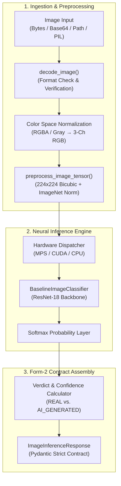

# Multi-Model AI System for Detecting AI-Generated Content (Text, Image & Audio)

**Project ID:** `SKIT/AI/2023-2027/07`  
**Department:** Computer Science & Engineering (Artificial Intelligence)  
**Institution:** Swami Keshvanand Institute of Technology, Management & Gramothan (SKIT), Jaipur  
**Academic Year:** 2026–27 (Phase-II, 7th Semester)  

### 👥 Team Members & Roles (Form – 2)
- **Team Lead:** Dev Khandelwal (`23ESKCA035`) — Backend Infrastructure & Audio Detection Module
- **Member 1:** Divisha Manak Bohra (`23ESKCA038`) — Image Detection Modality & Image Interface
- **Member 2:** Aryansh Agarwal (`23ESKCA021`) — Frontend Architecture & Text Detection Module

---

# Member 1: Divisha Manak Bohra (`23ESKCA038`)

## 📌 Form – 2 Sprint Progress & Milestone Tracker

### Sprint 1 — Data Preparation & Interface (03-Aug-2026 to 20-Sep-2026)
*User Story: Preparing image data and authentication interface*

| S.No. | Form-2 Sprint 1 Task | Implementation | Status |
|---|---|---|---|
| 1 | **Collecting and organising image datasets for real/AI-generated classification** | Curated 132,000 real and synthetic images across CIFAKE and GenImage datasets. | Completed & Verified (Week 1) |
| 2 | **Creating balanced train, validation and test splits** | Generated 90k train, 10k val, 20k test, and 12k holdout splits with exact 50/50 class balance (`seed=42`). | Completed & Verified (Week 2) |
| 3 | **Designing login and registration interface components** | Reusable UI primitives (`Input`, `Button`, `AuthCard`, `PasswordRequirements`, `FormAlert`). | Completed & Verified (Week 3) |
| 4 | **Building responsive authentication screens and handling representative form states** | Responsive `/login` and `/register` pages with form validation, dynamic password strength meter, and session handling. | Completed & Verified (Week 4) |

---

### Sprint 2 — Baseline Detection Service (21-Sep-2026 to 08-Nov-2026)
*User Story: Building the image detection module*

| S.No. | Form-2 Sprint 2 Task | Implementation | Status |
|---|---|---|---|
| 1 | **Developing an image inference service with a defined input/output interface** | **Week 1:** Production-ready `ImageDetectionService` (ResNet-18, MPS/CUDA/CPU).<br/>**Week 2:** I/O API Specification, `/api/detect/image` endpoint with strict validation & `services/image-service` microservice. | **Completed & Verified (Weeks 1 & 2)** |
| 2 | **Designing batch-processing logic for multiple image inputs** | Batched tensor collation, chunking ($B \le 32$), and multi-file pipeline. | Scheduled (Week 3) |
| 3 | **Testing image inference using grouped input samples** | Grouped evaluation on Sprint 1 test & holdout partitions from `manifest.csv`. | Scheduled (Week 4) |
| 4 | **Designing image upload and result interaction components** | Interactive Next.js multi-file drag-and-drop uploader, verdict gauges, and batch results gallery. | Scheduled (Weeks 5–7) |


---

## 🚀 Sprint 2 Week 1 Deliverables: Image Inference Engine Foundation & Defined I/O Contract

In Week 1 of Sprint 2, we built the core image detection engine architecture under [`src/image_detector/`](src/image_detector/):



### 📁 Architecture & File Layout

| Component | Path | Description |
|---|---|---|
| **Defined I/O Schema** | [`src/image_detector/schemas.py`](src/image_detector/schemas.py) | Strictly typed Pydantic models for `PredictionVerdict`, `ClassProbabilities`, `ImageMetadata`, `ImageInferenceRequest`, and `ImageInferenceResponse`. |
| **Ingestion & Preprocessing** | [`src/image_detector/preprocessing.py`](src/image_detector/preprocessing.py) | Ingests binary bytes, RFC 2397 base64 data URIs, file paths, and PIL images; normalizes channels to 3-channel RGB; handles corrupted inputs. |
| **Model Architecture** | [`src/image_detector/model.py`](src/image_detector/model.py) | Forensic ResNet-18 classifier supporting Apple Silicon GPU (`mps`), NVIDIA CUDA, or CPU fallback. |
| **Inference Orchestrator** | [`src/image_detector/service.py`](src/image_detector/service.py) | `ImageDetectionService` running end-to-end inference and sub-10ms hardware-accelerated latency measurement. |
| **Package Exports** | [`src/image_detector/__init__.py`](src/image_detector/__init__.py) | Clean modular imports and domain-specific exception exports. |
| **Automated Tests** | [`tests/test_image_inference_service.py`](tests/test_image_inference_service.py) | Pytest test suite covering input flexibility, determinism, schema compliance, and corrupted payload handling. |
| **Verification Suite** | [`scripts/verify_sprint2_week1.py`](scripts/verify_sprint2_week1.py) | Standalone 6-point verification suite with hardware diagnostics and latency benchmarks. |

### 📋 Standardized Output Contract (Form – 2 Specification)

```json
{
  "filename": "sample.png",
  "verdict": "REAL",
  "is_ai": false,
  "confidence": 0.9962,
  "probabilities": {
    "real": 0.9962,
    "ai_generated": 0.0038
  },
  "image_metadata": {
    "width": 200,
    "height": 200,
    "channels": 3,
    "format": "PNG"
  },
  "latency_ms": 5.45,
  "model_version": "baseline-resnet18-v1.0",
  "device": "mps"
}
```

---

## 🚀 Sprint 2 Week 2 Deliverables: I/O API Specification & Strict Validation (`/api/detect/image`)

In Week 2 of Sprint 2, we built the public-facing REST API specification and containerized microservice:

### 📁 Architecture & File Layout

| Component | Path | Description |
|---|---|---|
| **API Endpoints & Router** | [`src/image_detector/api.py`](src/image_detector/api.py) | FastAPI router implementing `/api/detect/image` (multipart) and `/api/detect/image/base64` with multi-tier validation guardrails. |
| **API Data Contracts** | [`src/image_detector/schemas.py`](src/image_detector/schemas.py) | Enriched API schemas: `ImageDetectionAPIResponse` with UUID `request_id`, ISO UTC timestamp, and RFC 7807 `APIErrorResponse`. |
| **Microservice Entrypoint** | [`services/image-service/app/main.py`](services/image-service/app/main.py) | Standalone FastAPI microservice on port 8004 with CORS, `/internal/health`, and interactive Swagger UI (`/docs`). |
| **Containerization** | [`services/image-service/Dockerfile`](services/image-service/Dockerfile) | Multi-stage production container image running as non-root user. |
| **Docker Compose** | [`docker-compose.yml`](docker-compose.yml) | Integrated `image-service` on port `8004:8004` within `forensics_net`. |
| **Automated API Tests** | [`tests/test_image_detection_api.py`](tests/test_image_detection_api.py) | 15 unit and integration tests covering happy paths, edge cases, and all HTTP error codes. |
| **Verification Suite** | [`scripts/verify_sprint2_week2.py`](scripts/verify_sprint2_week2.py) | Standalone 8-point automated verification suite. |

### 🛡️ Strict Validation Rules & HTTP Status Codes

| Rule / Condition | HTTP Code | Error Code | Description |
|---|---|---|---|
| **Valid Image Upload** | `200 OK` | — | Inference succeeds; returns verdict, confidence, probabilities, telemetry. |
| **Empty Payload** | `400 Bad Request` | `EMPTY_PAYLOAD` | File has 0 bytes or empty base64 string. |
| **Payload Too Large** | `413 Payload Too Large` | `PAYLOAD_TOO_LARGE` | File exceeds maximum upload limit of 15 MB. |
| **Unsupported Extension** | `415 Unsupported Media` | `UNSUPPORTED_EXTENSION` | Extension not in `.png`, `.jpg`, `.jpeg`, `.webp`. |
| **Spoofed Magic Bytes** | `415 Unsupported Media` | `INVALID_MAGIC_BYTES` | File header does not match PNG/JPEG/WEBP binary signatures. |
| **Corrupted Payload** | `422 Unprocessable` | `CORRUPTED_IMAGE` | Image stream cannot be loaded or is truncated. |
| **Dimension Out of Bounds** | `422 Unprocessable` | `DIMENSION_TOO_SMALL` / `DIMENSION_TOO_LARGE` | Image resolution below 16x16 or above 8192x8192. |

### 📋 API Output Response Contract Example

```json
{
  "filename": "sample.png",
  "verdict": "REAL",
  "is_ai": false,
  "confidence": 0.9962,
  "probabilities": {
    "real": 0.9962,
    "ai_generated": 0.0038
  },
  "image_metadata": {
    "width": 200,
    "height": 200,
    "channels": 3,
    "format": "PNG"
  },
  "latency_ms": 5.45,
  "model_version": "baseline-resnet18-v1.0",
  "device": "mps",
  "request_id": "7c616730-dac6-40a4-ae1a-d42a591168f4",
  "timestamp": "2026-09-26T10:02:18.123456+00:00",
  "status": "success"
}
```

---


## 📁 Sprint 1 Architecture & Archive (Data Preparation & Interface)

### 🗂️ Dataset Partitioning & Stratification (Task 1 & Task 2)

All partition metadata is stored in [`datasets/splits/manifest.csv`](datasets/splits/manifest.csv) (132,000 records).

| Split | Partition Role | Total Images | Real ($y=0$) | AI Synthetic ($y=1$) | Class Balance | Sources |
|---|---|---|---|---|---|---|
| `train` | Training | 90,000 | 45,000 | 45,000 | 50.0% / 50.0% | CIFAKE (CIFAR-10 / SD-v1.4) |
| `val` | Validation | 10,000 | 5,000 | 5,000 | 50.0% / 50.0% | CIFAKE (CIFAR-10 / SD-v1.4) |
| `test` | In-Domain Test | 20,000 | 10,000 | 10,000 | 50.0% / 50.0% | CIFAKE (CIFAR-10 / SD-v1.4) |
| `holdout` | Out-of-Domain Holdout | 12,000 | 6,000 | 6,000 | 50.0% / 50.0% | GenImage (Real, SD, Midjourney, BigGAN) |
| **Total** | **All Splits** | **132,000** | **66,000** | **66,000** | **50.0% / 50.0%** | **Multi-Generator Corpus** |

- **Class Balance:** Exact 50.0% real and 50.0% fake across all partitions.
- **Zero Leakage:** Confirmed 0 duplicate file paths across train, val, test, and holdout splits.
- **Reproducibility:** Deterministic split assignment using pseudo-random seed `42`.

### 🔐 Authentication UI Primitives & Responsive Screens (Task 3 & Task 4)

- **UI Primitives:** [`Input`](frontend/src/components/ui/Input.tsx), [`Button`](frontend/src/components/ui/Button.tsx), [`AuthCard`](frontend/src/components/auth/AuthCard.tsx), [`PasswordRequirements`](frontend/src/components/auth/PasswordRequirements.tsx), [`FormAlert`](frontend/src/components/ui/FormAlert.tsx).
- **Screens:** Responsive [`/login`](frontend/src/app/(auth)/login/page.tsx) and [`/register`](frontend/src/app/(auth)/register/page.tsx) with inline validation, password strength meter, and session management.

---

# Member 2: Aryansh Agarwal (`23ESKCA021`)

## Sprint 1 — Frontend Architecture & Text Dataset Preparation
*User Story: Preparing text data and frontend architecture*

### 📌 Milestone Overview
- **Form-2 Task 1:** *Implementing core frontend architecture and preparing the Robust AI Detection (RAID) text benchmark.*

### 📁 Deliverables & Architecture

| Component | Path | Description |
|---|---|---|
| **Frontend Foundation** | [`frontend/`](frontend/) | Next.js 16 (App Router), TypeScript, Tailwind CSS, Axios API client. |
| **UI & Layout** | [`frontend/src/components/`](frontend/src/components/) | Reusable `Navbar`, `Footer`, `UploadDropzone`, `JobStatusCard`, `Button`, `Modal`, `LoadingSpinner`. |
| **Application Pages** | [`frontend/src/app/`](frontend/src/app/) | Initial routes: `/`, `/login`, `/register`, `/dashboard`, `/health`. |
| **Text Data Pipeline** | [`scripts/prepare_text_dataset.py`](scripts/prepare_text_dataset.py) | Streams HF `liamdugan/raid`, balances classes, generates text manifest. |
| **Text Manifest** | [`datasets/splits/text_manifest.csv`](datasets/splits/text_manifest.csv) | Final 20,000-record text split (80/10/10). |

### 🗂️ Dataset Sources & Organisation
- 10,000 human-written samples, 10,000 AI-generated samples across 11 generators (ChatGPT, Cohere, LLaMA, Mistral, GPT-4, etc.).
- 80/10/10 split: Train (16,000), Validation (2,000), Test (2,000).

---

# Team Lead: Dev Khandelwal (`23ESKCA035`)

## Sprint 1 — Foundation & Infrastructure
*User Story: Setting up backend infrastructure*

Detailed Sprint 1 documentation and architecture available in [`docs/dev-khandelwal/SPRINT_1_STATUS.md`](docs/dev-khandelwal/SPRINT_1_STATUS.md).

### 📁 Backend Microservices & Infrastructure
- **API Gateway:** [`services/api-gateway/`](services/api-gateway/) (FastAPI, reverse proxy, upload pipeline, MinIO, RabbitMQ dispatch).
- **Auth Service:** [`services/auth-service/`](services/auth-service/) (FastAPI, JWT authentication, Argon2 hashing, Redis rate limiter).
- **Stub Consumer:** [`services/stub-consumer/`](services/stub-consumer/) (Asynchronous RabbitMQ message processing worker).
- **Database & Migrations:** [`shared/db/`](shared/db/) (PostgreSQL models, Alembic migrations for Users, Jobs, Reports).
- **Orchestration:** [`docker-compose.yml`](docker-compose.yml) (PostgreSQL, RabbitMQ, Redis, MinIO, microservices).

---

## 🚀 Execution & Verification Instructions

### 1. Install Dependencies
```bash
# Core & Deep Learning dependencies
pip install -r requirements.txt

# Node dependencies (Frontend & Auth UI)
cd frontend && npm install && cd ..
```

### 2. Run Sprint 2 Verification Suites (Week 1 & Week 2)
```bash
# Week 1: Standalone inference engine verification
python3 scripts/verify_sprint2_week1.py
pytest tests/test_image_inference_service.py -v

# Week 2: Standalone API & strict validation verification
python3 scripts/verify_sprint2_week2.py
pytest tests/test_image_detection_api.py -v

# Run all 30 unit tests across Sprint 1 & Sprint 2
pytest tests/test_dataset_splits.py tests/test_image_inference_service.py tests/test_image_detection_api.py -v
```

### 3. Run Sprint 1 Verification Suites
```bash
# Image dataset splits and partition invariants
python3 scripts/verify_sprint1_splits.py
pytest tests/test_dataset_splits.py -v

# Frontend auth verification
node scripts/verify_auth_components.mjs
```

### 4. Code Quality & Formatting
```bash
ruff check src/ services/ scripts/ tests/
```

