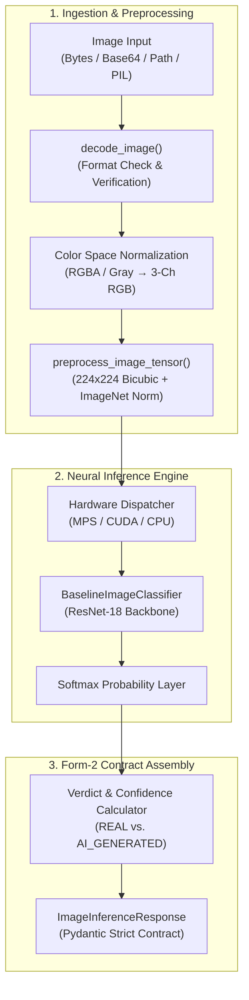

# Multi-Model AI System for Detecting AI-Generated Content (Text, Image & Audio)

**Member 1:** Divisha Manak Bohra (`23ESKCA038`)  
**Department:** Computer Science & Engineering (Artificial Intelligence)  
**Institution:** Swami Keshvanand Institute of Technology, Management & Gramothan (SKIT), Jaipur  
**Academic Year:** 2026–27 (Phase-II, 7th Semester)  
**Project Role:** Image Modality Detection Engine & Image Detection User Interface  

---

## 📌 Form – 2 Sprint Progress & Milestone Tracker

### Sprint 1 — Data Preparation & Interface (03-Aug-2026 to 20-Sep-2026)
*User Story: Preparing image data and authentication interface*

| S.No. | Form-2 Sprint 1 Task | Implementation | Status |
|---|---|---|---|
| 1 | **Collecting and organising image datasets for real/AI-generated classification** | Curated 132,000 real and synthetic images across CIFAKE and GenImage datasets. | Completed & Verified (Week 1) |
| 2 | **Creating balanced train, validation and test splits** | Generated 90k train, 10k val, 20k test, and 12k holdout splits with exact 50/50 class balance (`seed=42`). | Completed & Verified (Week 2) |
| 3 | **Designing login and registration interface components** | Reusable UI primitives (`Input`, `Button`, `AuthCard`, `PasswordRequirements`, `FormAlert`). | Completed & Verified (Week 3) |
| 4 | **Building responsive authentication screens and handling representative form states** | Responsive `/login` and `/register` pages with form validation, dynamic password strength meter, and session handling. | Completed & Verified (Week 4) |

---

### Sprint 2 — Baseline Detection Service (21-Sep-2026 to 08-Nov-2026)
*User Story: Building the image detection module*

| S.No. | Form-2 Sprint 2 Task | Implementation | Status |
|---|---|---|---|
| 1 | **Developing an image inference service with a defined input/output interface** | Production-ready `ImageDetectionService` with strictly typed Pydantic contracts, multi-input decoder, ResNet-18 baseline, and hardware acceleration (`mps`/`cuda`/`cpu`). | **Completed & Verified (Week 1)** |
| 2 | **Designing batch-processing logic for multiple image inputs** | Batched tensor collation, chunking ($B \le 32$), and multi-file pipeline. | Scheduled (Weeks 2–3) |
| 3 | **Testing image inference using grouped input samples** | Grouped evaluation on Sprint 1 test & holdout partitions from `manifest.csv`. | Scheduled (Week 4) |
| 4 | **Designing image upload and result interaction components** | Interactive Next.js multi-file drag-and-drop uploader, verdict gauges, and batch results gallery. | Scheduled (Weeks 5–7) |

---

## 🚀 Sprint 2 Week 1 Deliverables: Image Inference Engine Foundation & Defined I/O Contract

In Week 1 of Sprint 2, we built the core image detection engine architecture under [`src/image_detector/`](src/image_detector/):



### 📁 Architecture & File Layout

| Component | Path | Description |
|---|---|---|
| **Defined I/O Schema** | [`src/image_detector/schemas.py`](src/image_detector/schemas.py) | Strictly typed Pydantic models for `PredictionVerdict`, `ClassProbabilities`, `ImageMetadata`, `ImageInferenceRequest`, and `ImageInferenceResponse`. |
| **Ingestion & Preprocessing** | [`src/image_detector/preprocessing.py`](src/image_detector/preprocessing.py) | Ingests binary bytes, RFC 2397 base64 data URIs, file paths, and PIL images; normalizes channels to 3-channel RGB; handles corrupted inputs. |
| **Model Architecture** | [`src/image_detector/model.py`](src/image_detector/model.py) | Forensic ResNet-18 classifier supporting Apple Silicon GPU (`mps`), NVIDIA CUDA, or CPU fallback. |
| **Inference Orchestrator** | [`src/image_detector/service.py`](src/image_detector/service.py) | `ImageDetectionService` running end-to-end inference and sub-10ms hardware-accelerated latency measurement. |
| **Package Exports** | [`src/image_detector/__init__.py`](src/image_detector/__init__.py) | Clean modular imports and domain-specific exception exports. |
| **Automated Tests** | [`tests/test_image_inference_service.py`](tests/test_image_inference_service.py) | Pytest test suite covering input flexibility, determinism, schema compliance, and corrupted payload handling. |
| **Verification Suite** | [`scripts/verify_sprint2_week1.py`](scripts/verify_sprint2_week1.py) | Standalone 6-point verification suite with hardware diagnostics and latency benchmarks. |

### 📋 Standardized Output Contract (Form – 2 Specification)

```json
{
  "filename": "sample.png",
  "verdict": "REAL",
  "is_ai": false,
  "confidence": 0.9962,
  "probabilities": {
    "real": 0.9962,
    "ai_generated": 0.0038
  },
  "image_metadata": {
    "width": 200,
    "height": 200,
    "channels": 3,
    "format": "PNG"
  },
  "latency_ms": 5.45,
  "model_version": "baseline-resnet18-v1.0",
  "device": "mps"
}
```

---

## 📁 Sprint 1 Architecture & Archive (Data Preparation & Interface)

### 🗂️ Dataset Partitioning & Stratification (Task 1 & Task 2)

All partition metadata is stored in [`datasets/splits/manifest.csv`](datasets/splits/manifest.csv) (132,000 records).

| Split | Partition Role | Total Images | Real ($y=0$) | AI Synthetic ($y=1$) | Class Balance | Sources |
|---|---|---|---|---|---|---|
| `train` | Training | 90,000 | 45,000 | 45,000 | 50.0% / 50.0% | CIFAKE (CIFAR-10 / SD-v1.4) |
| `val` | Validation | 10,000 | 5,000 | 5,000 | 50.0% / 50.0% | CIFAKE (CIFAR-10 / SD-v1.4) |
| `test` | In-Domain Test | 20,000 | 10,000 | 10,000 | 50.0% / 50.0% | CIFAKE (CIFAR-10 / SD-v1.4) |
| `holdout` | Out-of-Domain Holdout | 12,000 | 6,000 | 6,000 | 50.0% / 50.0% | GenImage (Real, SD, Midjourney, BigGAN) |
| **Total** | **All Splits** | **132,000** | **66,000** | **66,000** | **50.0% / 50.0%** | **Multi-Generator Corpus** |

- **Class Balance:** Exact 50.0% real and 50.0% fake across all partitions.
- **Zero Leakage:** Confirmed 0 duplicate file paths across train, val, test, and holdout splits.
- **Reproducibility:** Deterministic split assignment using pseudo-random seed `42`.

### 🔐 Authentication UI Primitives & Responsive Screens (Task 3 & Task 4)

- **UI Primitives:** [`Input`](frontend/src/components/ui/Input.tsx), [`Button`](frontend/src/components/ui/Button.tsx), [`AuthCard`](frontend/src/components/auth/AuthCard.tsx), [`PasswordRequirements`](frontend/src/components/auth/PasswordRequirements.tsx), [`FormAlert`](frontend/src/components/ui/FormAlert.tsx).
- **Screens:** Responsive [`/login`](frontend/src/app/(auth)/login/page.tsx) and [`/register`](frontend/src/app/(auth)/register/page.tsx) with inline validation, password strength meter, and session management.

---

## 🚀 Execution & Verification Instructions

### 1. Install Dependencies
```bash
# Core & Deep Learning dependencies
pip install -r requirements.txt

# Node dependencies (Frontend & Auth UI)
cd frontend && npm install && cd ..
```

### 2. Run Sprint 2 Week 1 Inference Service Verification
```bash
# Standalone 6-point verification suite
python3 scripts/verify_sprint2_week1.py

# Pytest suite for image inference service
pytest tests/test_image_inference_service.py -v
```

### 3. Run Sprint 1 Dataset & Auth Verification Suites
```bash
# Dataset splits and partition invariants
python3 scripts/verify_sprint1_splits.py
pytest tests/test_dataset_splits.py -v

# Run all pytest suites simultaneously
pytest tests/ -v

# Frontend auth verification
node scripts/verify_auth_components.mjs
```

### 4. Code Quality & Formatting
```bash
ruff check src/ scripts/ tests/
```
