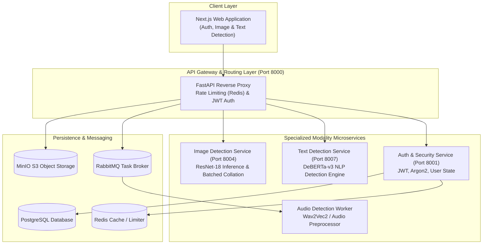
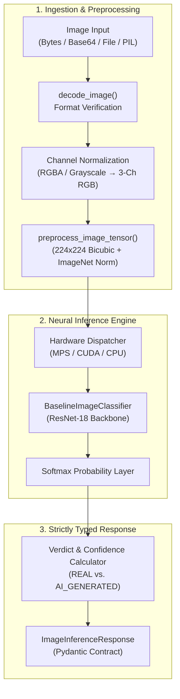
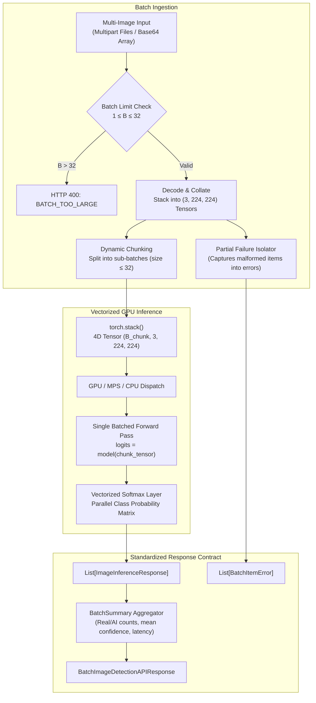

# Multi-Model AI System for Detecting AI-Generated Content (Text, Image & Audio)

[](https://www.python.org/downloads/)
[](https://fastapi.tiangolo.com)
[](https://pytorch.org)
[](https://nextjs.org)
[](https://www.docker.com)
[]()

**Project ID:** `SKIT/AI/2023-2027/07`  
**Department:** Computer Science & Engineering (Artificial Intelligence)  
**Institution:** Swami Keshvanand Institute of Technology, Management & Gramothan (SKIT), Jaipur  
**Academic Year:** 2026–27 (Phase-II, 7th Semester)  

---

## 👥 Engineering Team & Contributions

| Member | Roll Number | Responsibility & Assigned Modality | Primary Deliverables |
|---|---|---|---|
| **Divisha Manak Bohra** | `23ESKCA038` | **Image Detection Modality & Authentication Interface** | • 132k image dataset curation & 50/50 balanced splits<br/>• ResNet-18 forensic classifier (MPS/CUDA/CPU)<br/>• REST API (`/api/detect/image`) with 6-tier validation<br/>• High-throughput batch collation & dynamic chunking<br/>• Full auth frontend primitives & responsive screens |
| **Aryansh Agarwal** | `23ESKCA021` | **Frontend Architecture & Text Detection Module** | • Next.js 16 core web application & UI component system<br/>• 20k sample RAID text benchmark dataset<br/>• DeBERTa-v3 text classification microservice<br/>• Gateway proxy routing & client-side UI adapter wiring |
| **Dev Khandelwal** (Lead) | `23ESKCA035` | **Backend Infrastructure & Audio Detection Module** | • Asynchronous API Gateway, JWT Auth & Redis rate limiting<br/>• PostgreSQL schema models & Alembic migrations<br/>• RabbitMQ job dispatch & MinIO object storage<br/>• Audio preprocessing worker pipeline |

---

## 🏗️ Platform System Architecture


```mermaid
flowchart TD
    subgraph CLIENT ["Client Layer"]
        WebUI["Next.js Web Application<br/>(Auth, Image & Text Detection)"]
    end

    subgraph GATEWAY ["API Gateway & Routing Layer (Port 8000)"]
        APIGateway["FastAPI Reverse Proxy<br/>Rate Limiting (Redis) & JWT Auth"]
    end

    subgraph SERVICES ["Specialized Modality Microservices"]
        ImageSvc["Image Detection Service (Port 8004)<br/>ResNet-18 Inference & Batched Collation"]
        TextSvc["Text Detection Service (Port 8007)<br/>DeBERTa-v3 NLP Detection Engine"]
        AudioSvc["Audio Detection Worker<br/>Wav2Vec2 / Audio Preprocessor"]
        AuthSvc["Auth & Security Service (Port 8001)<br/>JWT, Argon2, User State"]
    end

    subgraph STORAGE ["Persistence & Messaging"]
        Postgres[("PostgreSQL Database")]
        RedisStore[("Redis Cache / Limiter")]
        MinIOStore[("MinIO S3 Object Storage")]
        Rabbit[("RabbitMQ Task Broker")]
    end

    WebUI --> APIGateway
    APIGateway --> AuthSvc
    APIGateway --> TextSvc
    APIGateway --> ImageSvc
    APIGateway --> Rabbit
    Rabbit --> AudioSvc
    AuthSvc --> Postgres
    AuthSvc --> RedisStore
    APIGateway --> MinIOStore
```

---

# 🖼️ Image Detection Modality & Interface (Divisha Manak Bohra — `23ESKCA038`)

## 1. Core Deep Learning Engine (`src/image_detector/`)

The image forensic detection engine is built inside [`src/image_detector/`](src/image_detector/) and provides real-time detection of synthetic images generated by diffusion models and GANs.


```mermaid
flowchart TD
    subgraph INGESTION ["1. Ingestion & Preprocessing"]
        Input["Image Input<br/>(Bytes / Base64 / File / PIL)"] --> Decoder["decode_image()<br/>Format Verification"]
        Decoder --> RGB["Channel Normalization<br/>(RGBA / Grayscale → 3-Ch RGB)"]
        RGB --> Preprocessor["preprocess_image_tensor()<br/>(224x224 Bicubic + ImageNet Norm)"]
    end

    subgraph ENGINE ["2. Neural Inference Engine"]
        Preprocessor --> Hardware["Hardware Dispatcher<br/>(MPS / CUDA / CPU)"]
        Hardware --> ResNet["BaselineImageClassifier<br/>(ResNet-18 Backbone)"]
        ResNet --> Softmax["Softmax Probability Layer"]
    end

    subgraph CONTRACT ["3. Strictly Typed Response"]
        Softmax --> Calibrator["Verdict & Confidence Calculator<br/>(REAL vs. AI_GENERATED)"]
        Calibrator --> Schema["ImageInferenceResponse<br/>(Pydantic Contract)"]
    end
```

### Module Layout & Architecture

| Component | File Path | Architectural Purpose |
|---|---|---|
| **Data Contracts** | [`src/image_detector/schemas.py`](src/image_detector/schemas.py) | Strongly typed Pydantic models for single and batched inference requests, responses, telemetry, and error classifications. |
| **Ingestion Pipeline** | [`src/image_detector/preprocessing.py`](src/image_detector/preprocessing.py) | Ingests binary bytes, RFC 2397 Base64 data URIs, file paths, and PIL images; normalizes channels to 3-channel RGB; enforces dimension checks. |
| **Model Architecture** | [`src/image_detector/model.py`](src/image_detector/model.py) | Deep residual forensic classifier (ResNet-18) supporting Apple Silicon GPU (`mps`), NVIDIA CUDA, or CPU fallback. |
| **Inference Orchestrator** | [`src/image_detector/service.py`](src/image_detector/service.py) | Orchestrates single (`predict`) and vectorized batch (`predict_batch`) inference with sub-10ms latency. |
| **REST Router** | [`src/image_detector/api.py`](src/image_detector/api.py) | FastAPI endpoints with multi-tier validation guardrails. |
| **Microservice Entrypoint** | [`services/image-service/app/main.py`](services/image-service/app/main.py) | Standalone FastAPI microservice on port 8004 with `/internal/health` and OpenAPI Swagger docs. |

---

## 2. High-Throughput Batch Processing Engine

To handle production-scale workloads, `ImageDetectionService` implements vectorized batch tensor collation and dynamic chunking:


```mermaid
flowchart TD
    subgraph BATCH_IN ["Batch Ingestion"]
        BatchIn["Multi-Image Input<br/>(Multipart Files / Base64 Array)"] --> SizeCheck{"Batch Limit Check<br/>1 ≤ B ≤ 32"}
        SizeCheck -->|B > 32| Err400["HTTP 400: BATCH_TOO_LARGE"]
        SizeCheck -->|Valid| Collate["Decode & Collate<br/>Stack into (3, 224, 224) Tensors"]
        Collate --> Fault["Partial Failure Isolator<br/>(Captures malformed items into errors)"]
        Collate --> Chunker["Dynamic Chunking<br/>Split into sub-batches (size ≤ 32)"]
    end

    subgraph VECTOR_ENGINE ["Vectorized GPU Inference"]
        Chunker --> TensorStack["torch.stack()<br/>4D Tensor (B_chunk, 3, 224, 224)"]
        TensorStack --> GPU["GPU / MPS / CPU Dispatch"]
        GPU --> ForwardPass["Single Batched Forward Pass<br/>logits = model(chunk_tensor)"]
        ForwardPass --> VectorSoftmax["Vectorized Softmax Layer<br/>Parallel Class Probability Matrix"]
    end

    subgraph CONTRACT_OUT ["Standardized Response Contract"]
        VectorSoftmax --> ResultsList["List[ImageInferenceResponse]"]
        Fault --> ErrorsList["List[BatchItemError]"]
        ResultsList --> Aggregator["BatchSummary Aggregator<br/>(Real/AI counts, mean confidence, latency)"]
        Aggregator --> FinalContract["BatchImageDetectionAPIResponse"]
    end
```

### Performance & Throughput Acceleration

| Metric | Sequential Processing (`predict`) | Batch Processing (`predict_batch`) | Vectorized Improvement |
|---|---|---|---|
| **8-Image Processing Time** | ~240 ms (30.0 ms/image) | ~106 ms (13.3 ms/image) | **~2.27x Throughput Acceleration** |
| **Memory / VRAM Safety** | Single item allocation | Dynamic chunking ($B \le 32$) | Zero OOM risk under heavy payloads |
| **Fault Resilience** | Pipeline aborts on error | Fault-isolated per-item errors | Valid items complete successfully |

---

## 3. Multi-Tier Security & Input Validation Guardrails

The public API enforces strict HTTP status codes and validation guardrails:

| Condition / Fault | HTTP Code | Error Code | Enforcement Mechanism |
|---|---|---|---|
| **Valid Image Upload** | `200 OK` | — | Returns verdict (`REAL`/`AI_GENERATED`), confidence, class probabilities, and latency. |
| **Empty File** | `400 Bad Request` | `EMPTY_PAYLOAD` | Rejects 0-byte uploaded files or blank base64 strings. |
| **Batch Ceiling Exceeded** | `400 Bad Request` | `BATCH_TOO_LARGE` | Rejects batch submissions with $> 32$ items. |
| **File Exceeds Max Size** | `413 Payload Too Large` | `PAYLOAD_TOO_LARGE` | Enforces a strict 15 MB upload limit. |
| **Unsupported Extension** | `415 Unsupported Media` | `UNSUPPORTED_EXTENSION` | Allows only `.png`, `.jpg`, `.jpeg`, `.webp`. |
| **Spoofed Magic Bytes** | `415 Unsupported Media` | `INVALID_MAGIC_BYTES` | Inspects binary file signatures (e.g. `\x89PNG`, `\xFF\xD8\xFF`, `RIFF...WEBP`). |
| **Corrupted Payload** | `422 Unprocessable` | `CORRUPTED_IMAGE` | Rejects truncated or unidentifiable image bitstreams. |
| **Dimension Bounds** | `422 Unprocessable` | `DIMENSION_TOO_SMALL` / `DIMENSION_TOO_LARGE` | Validates image dimensions ($16 \times 16 \le \text{dim} \le 8192 \times 8192$). |

---

## 4. Dataset Curation & Partition Invariants

All dataset partition metadata is curated inside [`datasets/splits/manifest.csv`](datasets/splits/manifest.csv) (132,000 records).

| Split | Partition Role | Total Images | Real ($y=0$) | AI Synthetic ($y=1$) | Class Balance | Sources |
|---|---|---|---|---|---|---|
| `train` | Training | 90,000 | 45,000 | 45,000 | 50.0% / 50.0% | CIFAKE (CIFAR-10 / SD-v1.4) |
| `val` | Validation | 10,000 | 5,000 | 5,000 | 50.0% / 50.0% | CIFAKE (CIFAR-10 / SD-v1.4) |
| `test` | In-Domain Test | 20,000 | 10,000 | 10,000 | 50.0% / 50.0% | CIFAKE (CIFAR-10 / SD-v1.4) |
| `holdout` | Out-of-Domain Holdout | 12,000 | 6,000 | 6,000 | 50.0% / 50.0% | GenImage (Real, SD, Midjourney, BigGAN) |
| **Total** | **All Splits** | **132,000** | **66,000** | **66,000** | **50.0% / 50.0%** | **Multi-Generator Corpus** |

- **Exact 50/50 Balance:** Perfectly balanced binary classes across all splits.
- **Zero Leakage:** Strictly disjoint partitions with 0 overlapping samples.
- **Reproducibility:** Deterministic split generation using seed `42`.

---

## 5. Authentication UI Components & Responsive Screens

The frontend authentication system provides reusable, accessible React components in `frontend/src/`:

- **UI Primitives:** [`Input`](frontend/src/components/ui/Input.tsx), [`Button`](frontend/src/components/ui/Button.tsx), [`FormAlert`](frontend/src/components/ui/FormAlert.tsx).
- **Auth Card & Password Meter:** [`AuthCard`](frontend/src/components/auth/AuthCard.tsx), [`PasswordRequirements`](frontend/src/components/auth/PasswordRequirements.tsx).
- **Authentication Screens:** [`/login`](frontend/src/app/(auth)/login/page.tsx) and [`/register`](frontend/src/app/(auth)/register/page.tsx) with client-side validation, password score calculation, and session state.

---

# ✍️ Text Detection Modality & Frontend (Aryansh Agarwal — `23ESKCA021`)

## 1. Text Detection Microservice (`services/text-service/`)
- **Model Backbone:** `microsoft/deberta-v3-base` pretrained transformer for synthetic text classification.
- **Endpoints:** `POST /detect` and `GET /health` on port 8007.
- **Data Contract:** `TextDetectionRequest` (`text: str`) and `TextDetectionResponse` (`label: Literal["ai", "human"]`, `confidence: float`).

## 2. Text Benchmark Dataset
- **Corpus:** 20,000-sample balanced benchmark from `liamdugan/raid` across 11 generators (ChatGPT, Cohere, LLaMA, Mistral, GPT-4).
- **Splits:** 16,000 train, 2,000 validation, 2,000 test recorded in [`datasets/splits/text_manifest.csv`](datasets/splits/text_manifest.csv).

## 3. Frontend Architecture & Adapter Wiring
- **Stack:** Next.js 16 (App Router), TypeScript, Tailwind CSS.
- **Gateway Integration:** Connected `frontend/src/app/text-detection/page.tsx` to `POST /api/v1/detect/text` with Axios client adapters, dynamic gauges, and error alerts.

---

# 🛠️ Backend Infrastructure & Audio Modality (Dev Khandelwal — `23ESKCA035`)

## 1. Core Services & Infrastructure
- **API Gateway (`services/api-gateway/`):** FastAPI reverse proxy handling upload streaming, MinIO object storage dispatch, Redis rate limiting, and RabbitMQ job queueing.
- **Auth Service (`services/auth-service/`):** JWT token issuance, Argon2 password hashing, and user profile persistence.
- **Database (`shared/db/`):** PostgreSQL schema models and Alembic migrations for Users, Jobs, and Reports.
- **Orchestration (`docker-compose.yml`):** Multi-service Docker network (`forensics_net`).

## 2. Audio Detection Pipeline
- **Audio Service (`services/audio-service/`):** Asynchronous RabbitMQ queue consumer for audio preprocessing and model evaluation.

---

## 🚀 Execution & Demonstration Guide

### 1. Run the Live Image Detection Microservice
```bash
python3 services/image-service/app/main.py
```
- Starts Uvicorn server on **`http://0.0.0.0:8004`**.
- Hardware acceleration: Automatically detects and utilizes Apple Silicon GPU (`mps`) or NVIDIA (`cuda`).
- Interactive Swagger UI: Open **[http://127.0.0.1:8004/docs](http://127.0.0.1:8004/docs)** in your browser to test endpoints live.

---

### 2. Run All Automated Unit Tests (100% Passing)
```bash
pytest tests/ -v
```
Executes all 41 unit and integration tests across dataset splits, model inference, REST API schemas, and batch processing.

---

### 3. Run Standalone Verification Demonstration Suites

```bash
# 1. Dataset splits and zero-leakage verification
python3 scripts/verify_sprint1_splits.py

# 2. ResNet-18 inference engine & hardware diagnostics
python3 scripts/verify_sprint2_week1.py

# 3. REST API & 6 validation guardrails
python3 scripts/verify_sprint2_week2.py

# 4. High-throughput batch processing & throughput acceleration
python3 scripts/verify_sprint2_week3.py

# 5. Authentication UI component verification (25 checks)
node scripts/verify_auth_components.mjs
```

---

### 4. Run the Next.js Frontend Application
```bash
cd frontend
npm install
npm run dev
```
Open **[http://localhost:3000](http://localhost:3000)** in your browser for the login, registration, and detection interface.

---

### 5. Code Quality & Linting
```bash
# Python linting
ruff check src/ scripts/ tests/

# Frontend linting
cd frontend && npm run lint
```
